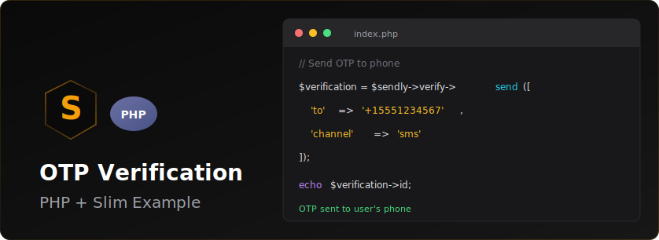

<p align="center">
  
</p>


# Sendly PHP OTP Verification Example

A complete phone number verification example using the Sendly PHP SDK.

## Features

- Phone number input with validation
- Send OTP via Sendly Verify API
- Verify OTP code
- Session management
- Clean, responsive UI
- Error handling

## Requirements

- PHP 8.1 or higher
- Composer
- Sendly API key

## Installation

1. Clone or download this example

2. Install dependencies:
```bash
composer install
```

3. Configure your API key:
```bash
cp .env.example .env
```

Edit `.env` and add your Sendly API key:
```
SENDLY_API_KEY=your_actual_api_key_here
```

4. Load environment variables (choose one method):

**Option A: Using PHP built-in server with environment variable**
```bash
SENDLY_API_KEY=your_api_key php -S localhost:8000
```

**Option B: Export environment variable**
```bash
export SENDLY_API_KEY=your_api_key
php -S localhost:8000
```

**Option C: Use vlucas/phpdotenv package**
Add to composer.json:
```json
{
    "require": {
        "vlucas/phpdotenv": "^5.5"
    }
}
```

Then add to the top of `send-otp.php` and `verify-otp.php`:
```php
require_once 'vendor/autoload.php';
$dotenv = Dotenv\Dotenv::createImmutable(__DIR__);
$dotenv->load();
```

## Usage

1. Start the PHP development server:
```bash
php -S localhost:8000
```

2. Open your browser and navigate to:
```
http://localhost:8000
```

3. Enter a phone number with country code (e.g., +1234567890)

4. Enter the verification code received via SMS

5. See the success page upon verification

## File Structure

```
sendly-php-otp-example/
├── composer.json          # Dependencies
├── index.php              # Phone number input page
├── send-otp.php           # Sends OTP via Sendly API
├── verify.php             # OTP input page
├── verify-otp.php         # Verifies OTP via Sendly API
├── success.php            # Success confirmation page
├── .env.example           # Environment variables template
├── .gitignore             # Git ignore rules
└── README.md              # This file
```

## How It Works

1. **index.php**: User enters their phone number
2. **send-otp.php**: Calls `$client->verify->send(['to' => $phone])` and stores verification ID in session
3. **verify.php**: User enters the OTP code received
4. **verify-otp.php**: Calls `$client->verify->check($id, ['code' => $code])` to verify the code
5. **success.php**: Displays success message if verification passes

## API Reference

### Send OTP
```php
$client = new Sendly($apiKey);
$response = $client->verify->send([
    'to' => '+1234567890'
]);
$verificationId = $response->id;
```

### Verify OTP
```php
$result = $client->verify->check($verificationId, [
    'code' => '123456'
]);

if ($result->status === 'verified') {
    // Success
}
```

## Security Notes

- Never commit `.env` file with real API keys
- Always validate phone numbers on server-side
- Use HTTPS in production
- Implement rate limiting to prevent abuse
- Store verification IDs in secure sessions

## Learn More

- [Sendly PHP SDK](https://github.com/SendlyHQ/sendly-php)
- [Sendly Documentation](https://sendly.live/docs)
- [Sendly API Reference](https://sendly.live/docs/api)

## License

MIT
